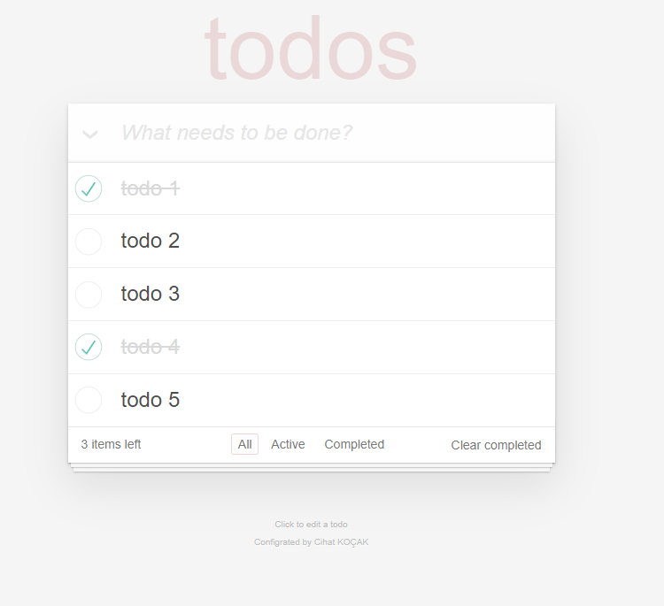

# To-Do List /w Redux

I developed a simple to-do list app using redux and learned a lot doing it.


## Used technologies

**Client:** React, Redux, reduxjs/toolkit, Thunk, Axios, Dotenv

**API:** Node, Express, Cors,Nanoid

  
## Screenshots

You can view the screenshots or watch the <a href ="https://www.youtube.com/watch?v=KB9Itdf3S8Q">video</a> below.



  
## API USAGE

#### Fetch all items

```http
  GET /todos
```


#### Add item

```http
  POST /todos
```

| Parameter | Type | Description                       |
| :--------  | :----| :-------------------------------- |
| `{text}` |  `string`   | Listeye eklenecek metni göndermeniz yeterli |


#### Update item


```http
  PATCH /todos/:id
```

| Parameter | Type     | Description                       |
| :-------- | :------- | :-------------------------------- |
| `id`      | `string` | ID'si girilen todo elemanının completed durumunu değiştirir. |


#### Delete completed items

```http
  DELETE /todos/clearcompleted
```

| Parametre | Açıklama                       |
| :--------  | :-------------------------------- |
| `none`     | Tamamlanmış todo nesnelerini siler |

#### Delete item

```http
  DELETE /todos/id
```

| Parametre | Tip     | Açıklama                       |
| :-------- | :------- | :-------------------------------- |
| `id`      | `string` | **Gerekli**. id eklemeniz yeterli. |


## Run it on your computer

Clone the project

```bash
  git clone https://github.com/CihatKOCAK/to-do-app-redux.git
```

Go to API directory

```bash
  cd api
```

Install required packages

```bash
  npm i
```

Run the server

```bash
  npm run server
```

Go to client directory

```bash
  cd client
```

Install required packages

```bash
  yarn
```

Run the client

```bash
  yarn start
```
